# 关于分布式环状资源依赖关系探测方案的思考
考虑到本文站在更高的抽象层次考虑算法的用途，因此下文以【成环依赖探测算法】代替【死锁检测算法】进行描述。
成环依赖探测方案基于论文《A Distributed Algorithm for Deadlock Detection and Resolution》，该论文描述了一种在分布式系统中可以探测到依赖关系成环的算法。该算法可以保证，在单出度依赖关系的场景下，在出现环状依赖关系后不会被外界主动打破依赖的前提下，最终会有且只有一个节点探测到这个成环依赖。在论文描述的基于优先级的改进方案中，更进一步的，可以保证最终形成环状关系依赖的所有节点中，设定为优先级最低的那个节点会探测到成环依赖。该算法在其假设前提下，在死锁检测这个场景中，很好的做到了避免误杀和多杀。

tips：  
* 单出度依赖关系：一个节点只能依赖于另外的【一个】节点，而非【多个】节点，但是该方案并不对节点的入度作限制，这意味着可以有多个节点依赖于本节点，但本节点在任意给定时刻只能依赖于至多一个节点。  
* 出现环状依赖关系后不会被外界主动打破依赖：如果在这个成环依赖探测算法中，某个节点在探测到依赖成环后准备kill掉自己，但是同时外界也主动打破依赖，使得环状依赖关系不再满足，很难界定该行为是否属于误杀，因此假定依赖关系成环后可以稳定存在，不会被外界主动打破。  
* 误杀：在没有形成环状依赖关系前，某个节点误判断当前已经形成环状依赖关系，并误把自己或者其他节点kill掉。  
* 多杀：在形成环状依赖关系后，有多个节点探测到成环依赖的事实，并都主动解除依赖，这使得算法打破成环依赖的代价高于所需的最小代价（只解除环中一个节点的依赖）。  
****
## 0 建立直觉

成环依赖的探测方案可大致分为两种，区别在于是否存在某个中心节点能看到全局视图。  
在分布式系统中，若存在这样一个中心节点，收集分散的信息，并集中管理的话，将造成系统对单点的过度依赖，在fail over和load balance的问题上要作额外考虑。  
另一种方案是每个节点只维护与自己相关的局部信息，没有任何节点存在全局视角，任意节点的fail不会影响成环依赖探测算法的活性，负载也比较分散，论文描述的算法基于后者。  
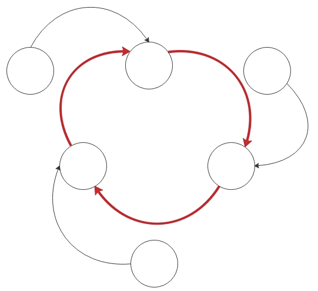  
该算法总体上讲，基于一种非常简单粗暴的直觉，就是一旦依赖关系成环后，就出现了一条消息通路，这条消息通路从自己出发，最终又回到自己，就好像你用光速向前方掷出了一块小石子，经过若干秒后，小石子击中了你自己的后脑勺，于是你就知道了地球是圆的。  
****
## 1 算法描述

每个节点可以视作为是一个状态机，在算法中，外部对状态机可以使用Block操作和Active操作来影响状态机的局部状态，每个节点上的状态机互相之间定期通过transmit操作来互相推进状态，最终某个节点检查到状态符合Detect条件，于是探测到成环依赖：  
  
1. 状态机的初始状态  
上图中，Block操作描述中的STATE BEFORE状态对应了所有状态机的初始化状态，每个状态机表示了最终成环图中的一个节点，每个状态机需要维护两个状态，论文中称为public_label与private_label。
论文中描述，每个节点的private_label值都是unique的，在每次Block之后，节点生成一个递增的，全局唯一的private_label，并同步替换掉自己的public_label。
2. 外部为两个状态机建立依赖关系（Block）  
在block动作发生的时候，节点需要更新自己的状态标识，并同步替换掉自己暂存区中学习到的值。
这一步需要执行上图中所述的inc(u, v)操作。
inc(u, v)将生成一个比u和v都要大的新值，用于更新public_label和private_label。
3. 外部为两个状态机解除依赖关系（Activate）  
当一个Activate动作发生的时候，节点状态机不修改任何状态，只是取消依赖关系，这将影响到transmit过程，使得自己不会再向其他节点学习任何内容。
4. 状态机之间的状态更新与推进（Transmit）  
Transmit过程是盘活所有节点的关键过程，由于每个节点只维护与自己相关的局部信息，每个状态机仅凭自己的信息无法确认成环依赖的出现，Transmit过程使得节点可以学习到它所依赖的节点上的public_label值，当自己的public_label值较小的情况下，用该值替换掉自己的public_label值。
Transmit过程为节点间建立了消息通路，使得成环依赖出现后，某个节点可以通过Transmit过程学习到自己的private_label值，并最终达成Detect状态。
5. 状态机的终态（Detect）  
当某个节点在Transmit过程中从它所依赖的节点上学习到的public_label值等于自己的private_label值的时候，就表示这个节点已经达到了状态机的终态，即它“扔出的石子绕地球一圈打中了自己的后脑勺”，于是它发现了地球是圆的，成环依赖出现。
在一个环状依赖图中的各个状态机中，有且仅有一个状态机会达成上述终态。
****
## 2 细节探讨

1. 状态机维护两个值，即public_label与private_label的必要性？各自的含义是怎样的？  
private_label是节点的逻辑时钟时间戳，每次状态更新后，逻辑时钟向前拨动，private_label递增（但并非每次+1）。  
public_label是节点的消息中转站，用于临时存储消息，且只存储label值最大的那个消息。  
假设每次block称为一次动作，每次动作后，节点的依赖状态会发生变化，可以把private_label看成是节点的每次动作后的状态标识，该标志只会增大，不会减少。（这意味着也许节点会出现两次block动作后依赖状态相同的的情况，但是private_label总是递增的，节点的状态标识不会回退）。  
public_label可以理解为消息的暂存坑位，每个状态机上都有这样一个坑位，来存储它所见过的最大的label值，之所以有这个坑位设计的必要，是因为论文所述的算法中的消息传递方式是一种基于主动学习的模式，这意味着label值的传输方向是逆箭头方向，在别人没有来学习之前，本节点要把未来别人可能要学习的label值暂存下来，称为public_label，学习的原则是节点总是倾向在坑位中记录更大的label值。  
假设没有private_label，节点就不知道自己发出消息时的逻辑时钟上的时间是多少，那么当它收到一个更新的public_label的时候就没办法判断是否是由自己发出的消息。  
假设没有public_label，节点就没办法学到离自己跨度超过一条边的节点，节点状态就没办法超过两个相邻的节点进行传播。
2. 主动学习（拉取）与被动传播（推送）的差异与取舍？  
在这篇论文所描述的tansmit过程是采用主动学习，即从本节点所依赖的节点上拉取public_label值的方式来使得信息在各节点间进行传播的，这种方式在真实系统的实现中，需要为每个节点建立定时任务，采用定时拉取的方式实现，显然这么做会产生延迟探测的情况。  
例如，在一个有N个节点的环状依赖图中，假设每个节点的定时任务每S秒触发一次，不考虑网络传输的延迟和机器负载高时消息处理速度慢等额外情况，那么最差情况下，可能需要N*S秒来使得环中的某个节点探测到成环依赖。假设N取10，S取3s，那么从发生环状等待关系到最终打破成环依赖的耗时将达到半分钟。  
采用时间驱动的主动学习的拉取方式在开销上很小，rpc数量也非常固定，不论环和分叉的规模是多大，每个节点每S秒只有一次rpc开销。  
与之相对应的，就是采用事件驱动的被动传播的方式来传递消息，每当一个节点的public_label值更改的时候，它就将自己的值推送给自己所依赖的节点，所依赖的节点将采用同样的方式推送，整个过程是立即发生的，不考虑消息传输的延迟和处理的开销，那么在依赖关系成环的那一瞬间，就会有某个节点探测到这个事实，并立即打破依赖关系。  
在真实的系统实现中，采用定时任务+拉取的方式可以很好的应对网络分区，分布式系统中的消息丢失、延迟的异常处理是必须要考虑的，定期拉取可以天然应对偶发的消息丢失与过大延迟，采用事件驱动+推送的方式则必须要考虑事件发生时发出的消息丢失的情况，因此仍然需要额外的定时任务作定期重试。这意味着采用事件驱动+推送的方式在开销上会更大，此外事件驱动+推送方式的rpc数量是不定的，取决于系统中节点的数量，和他们block动作发生的频率，相对来说开销更大且不可控。  
两种方式的取舍，将取决于我们对于系统中成环依赖关系探测功能的需求，评价我们对该功能的需求可以从两个维度出发，一是探测及时性，二是测探的开销。  
在这两个维度中，及时性应当是我们首要考虑的，即我们是否可以接受略大的探测延迟（秒级，以及在节点规模很大的情况下达到分钟级）？倘若过大的延迟是不可接受的，且参与该算法的系统的节点规模是可预期的，那么应当选择推送的方式。倘若略大的消息延迟是可接受的，并且系统的资源受限（例如网络带宽很宝贵），那么应当采取定时拉取的方式。倘若对延迟和资源的限制在需求上并不十分清晰，那么可以选择采用拉取的方式实现，并在真实系统中调低S的数值，配合rpc聚合、消息压缩、多节点在同一台机器上复用定时任务等手段进行调优，是更灵活的实现方案。  
3. Block动作过程中使用inc(u, v)更新label的必要性？  
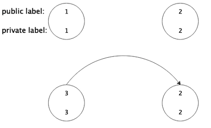  
inc(u, v)为发生block操作的节点计算了新的private_label值，计算的依据是新值必须要比u和v【都要大】，之所以需要按照这种方式去计算，是为了避免”环外污染“。下面解释一下“环外污染”：  
假设最初系统中存在四个节点，编号1，2，3，4，初始label值如下：  
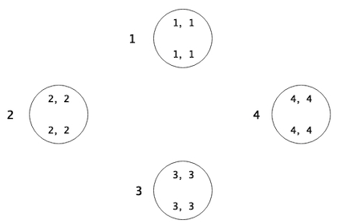  
上面的label值采用了两部分的方式进行描述，表示为<m, n>，高位为递增位，低位为节点编号位，每次生成新label值的时候只改变递增位，这将使得inc操作永远不会生成一个系统中已经存在的label值，按照3->2, 2->1, 1->4的顺序发生了block操作：  
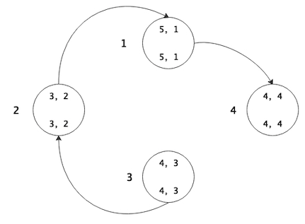  
之后4号节点可能也发生了block操作在5号节点上，并且更新了自己的label值：  
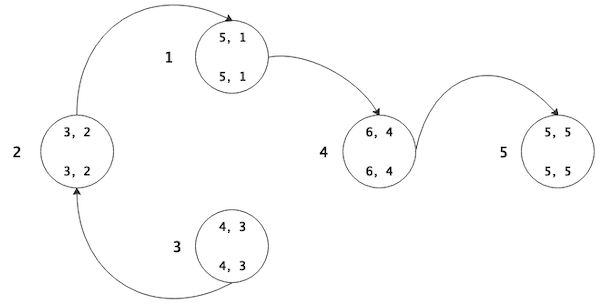  
经过若干轮transmit后，假设不再产生新的block动作，系统的稳定状态如下：  
  
此时假设1号节点，放弃对4号节点的依赖，转而依赖3号节点：  
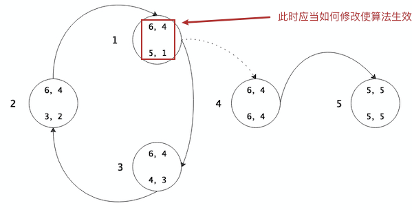  
成环依赖出现，但是假如1号节点不采用inc(u, v)的方式来更新自己的label值，环中传播就是一个环外的label值，环中将不会有节点可以达成detect的条件，因此inc(u, v)操作是必须的。  
至于必须要更新label值的原因也是为了确保环出现时，环中所存在的那个最大的label值一定属于环中的节点。  
值得注意的是，并不总是最后一个加入环的节点会创造出环中最大的那个label值。  
5. private_label为何必须要是全局唯一的？  
  
假设在上图所示的条件下，发生了1->2的block操作：  
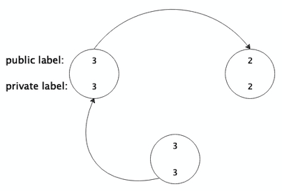  
1号节点通过inc操作生成了label值3，将导致3号节点发现detect条件，尽管当前依赖关系并未成环。  
6. 算法是通过何种手段避免误杀的  
inc操作确保生成的值是全局唯一的。  
这意味着在成环前，它不可能学到自己的private_label值。  
7. 算法是通过何种手段避免多杀的？  
在成环之后，环中只有一个人的private_label能和环中正在传递的最大的public_label值对应上。  
8. 算法为何要局限于单出度？  
算法依赖于单出度依赖关系，实际上是由于多出度场景下“反复横跳”导致的算法“活锁“问题，下面解释一下反复横跳与活锁。  
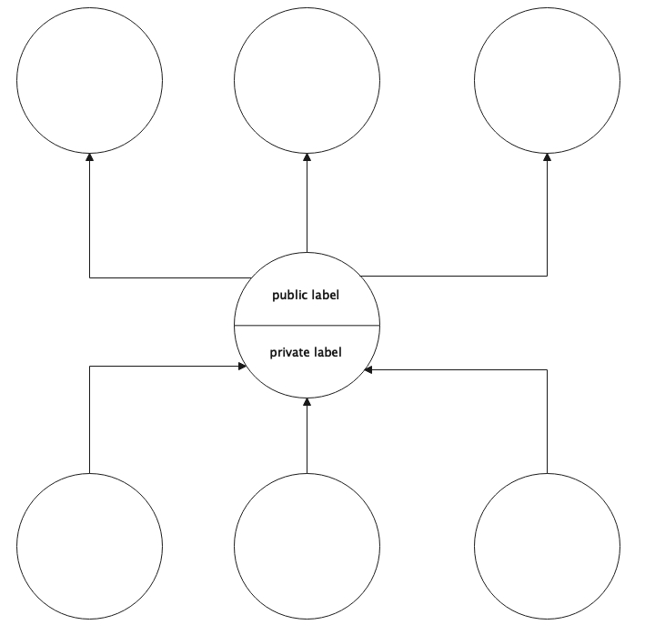  
将算法扩展到多出度的使用场景时，自然而然的一种想法就是一个节点向多个节点transmit数据，并且取其中最大的label值来更新自己的public label值。  
这将导致任意一条出度的路径的依赖关系发生变化的时候，都会影响到该节点所在的环，当系统中节点的依赖关系足够复杂，成环的参与节点足够多，依赖关系的更改频次足够高，甚至是“反复横跳”的时候，这种影响将变得尤其严重，以至于尽管环状依赖关系已然存在，但是算法可能在有限的时间内都没有办法感知到。  
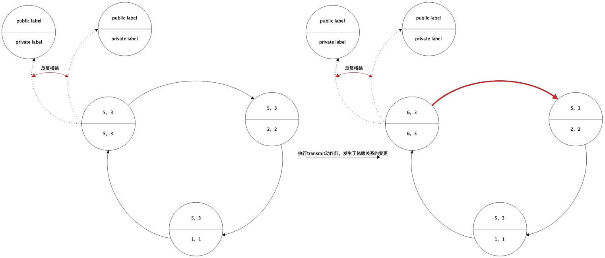  
如上图所示，在左半图所示的场景中，本来已经达成了detect的探测条件，但是在private label为<5,3>的节点发生transmit动作之前，它的另一条出度边发生了依赖关系的改变，导致它的label值发生了变化，以至于它的下一步transmit操作无法认识到依赖成环关系的出现，如果它的另一条出度边的依赖关系发生“反复横跳”，那么这种情况将循环发生，以至于算法始终无法监测到依赖成环的关系。  
9. 算法的最好情况与最坏情况分析？  
这篇文章所述的算法的最好以及最坏情况的场景依赖于环中各节点transmit动作发生的先后次序。  
针对某一个节点而言，它从依赖的人那里学到label值和依赖它的人从它这里学到label值，在事实上存在一前一后的顺序，在依赖关系成环之后，依据各节点transmit事件发生的先后顺序，存在最优序与最劣序，影响了这一算法的探测时延。  
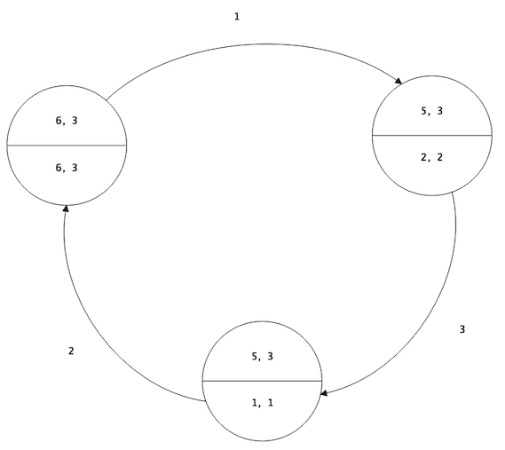  
如上图所示，假如label值为<6,3>的是环中最后一个发生block操作的节点，上图所示为三节点成环依赖的初始瞬间，那么如果各节点transmit的顺序如箭头旁标注的顺序，将需要3轮transmit来使得label值为<6,3>的节点意识到成环依赖。  
如上图所示，假如调整一下各节点在同一轮中transmit操作发生的先后顺序，那么只需要一轮transmit操作的过程，label值为<6,3>的节点就会意识到成环依赖。  
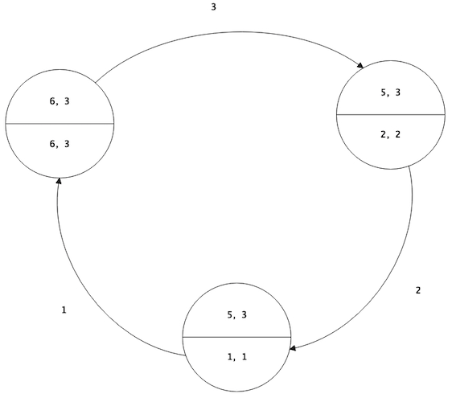  
假设环中的参与节点的个数是N个，transmit的间隔是S秒，那么根据环中label值最大的节点所处的位置以及一轮中各节点transmit次序的不同，算法在最好情况下，只需要S秒即可探测到依赖成环，在最坏情况下，则需要N*S秒来探测到依赖成环。  
****
## 3 带优先级的算法改进

尽管论文描述的算法在单出度场景下可以很好的如预期般工作，但是算法本身存在一个容易被忽视的对实际工程系统并不友好的问题，就是存活越久的节点，其label值就更倾向于演进得更大，于是在一个环中，存活时间最长的节点被kill掉的可能性最大，这应该并不符合大部分实际的系统kill节点的倾向需求，因此作者基于上述算法提出了一种基于优先级的成环依赖探测方案，可以使得当成环依赖条件出现的时候，被设定为优先级最低的那个节点探测到这一事实。  
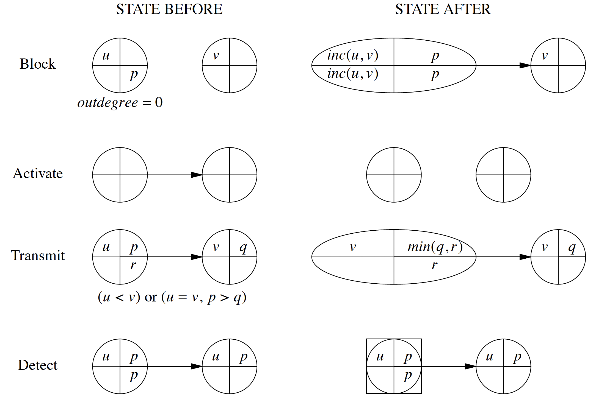  
改进后的算法描述如上图所示。  
原文对带优先级的探测方案的描述过于简略，缺乏细节，并且示意图也有点图不达意（可能是为了和不带优先级的算法示意图保持一致）。  
首先对上图作两处修改，以便我们更方便的理解改进后的算法。  
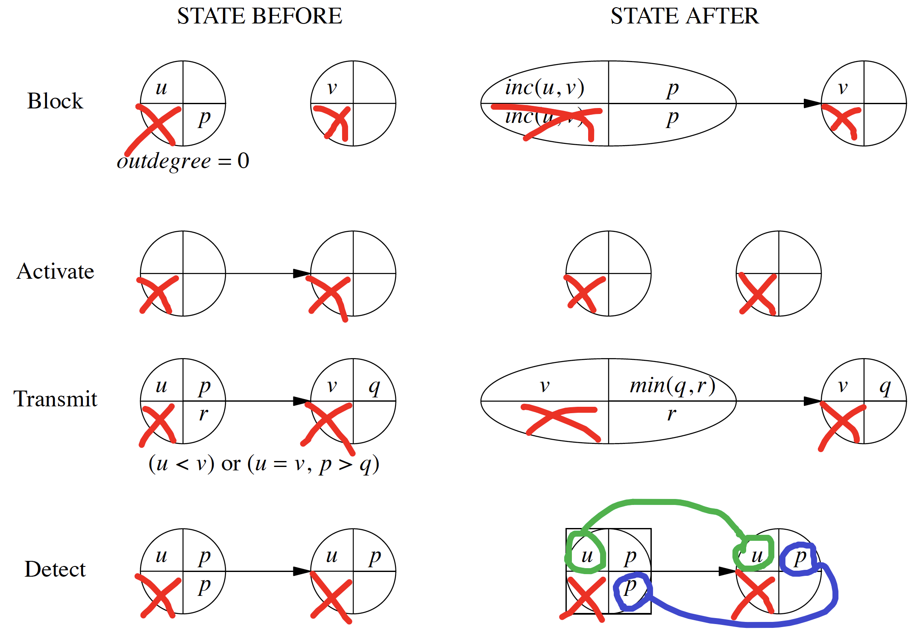  
首先是，我们去除掉private label，因为这个值在带优先级的算法中没有起到任何直观的作用。  
其次，明确Detect的条件，是：(slef.private_priority == others.public_priority) && (self.public_label  == others.public_label)  
最后，最关键的理解该算法能work的点就是transmit步骤的时候public priority的更新策略是min(q, r)，而非min(p, q)，以及更新public priority的时机，有一个条件是u\<v，此时尽管p比min\(q, r\)还要小也会被刷新掉。这是带优先级的算法能够避免“环外污染”的关键。  
那么public label起了一个什么作用呢？只有private priority和public priority不就行了？  
实际上pubic label起到的是一个轮次记录的作用，它只增大不减少，如果在transmit过程中，某个节点在从它所依赖的节点学习label和priority的过程中，发现尽管priority是自己的private priority，但是对方的label不是自己的public label（此种情况下，我断言对方的label值一定比本节点的label值更小），那么它就不能判断当前是否已经成环，反例参考下图：  
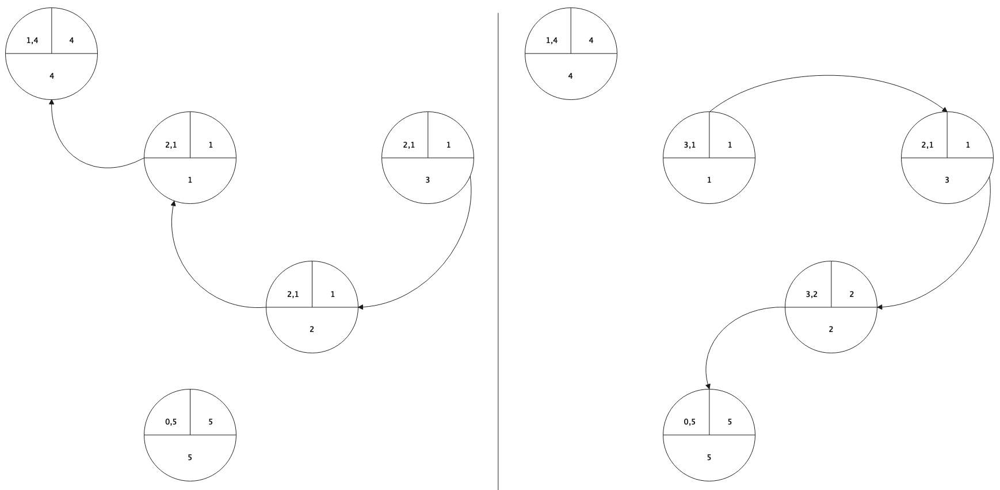  
在上图的依赖关系的变换中，并未成环，private priority为1的节点也并没有探测到环，这归功于它利用增大了自己public label的手段提升了自己的“轮次”，从而过滤掉了private priority为3的节点上的信息。  
****
基于本算法可以更进一步的思考一下如何改良成多出度的探测算法？  
除了文中列出的方式，还有何种改良方式？  
要作哪些取舍？使用场景有何不同？